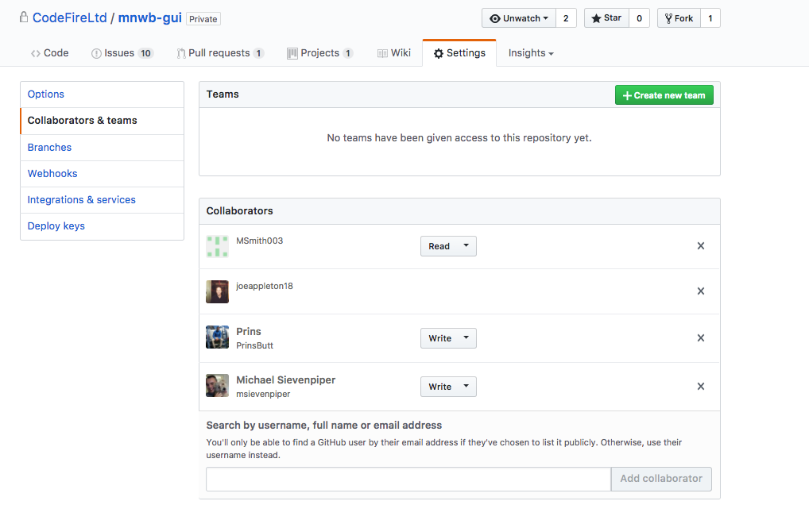
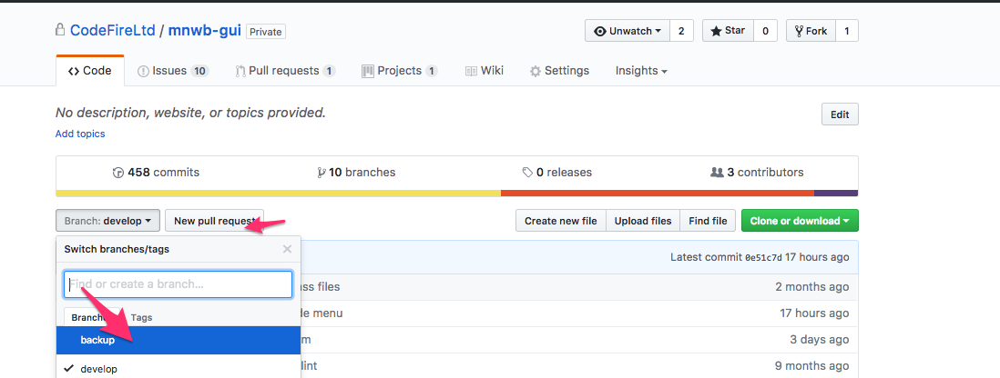
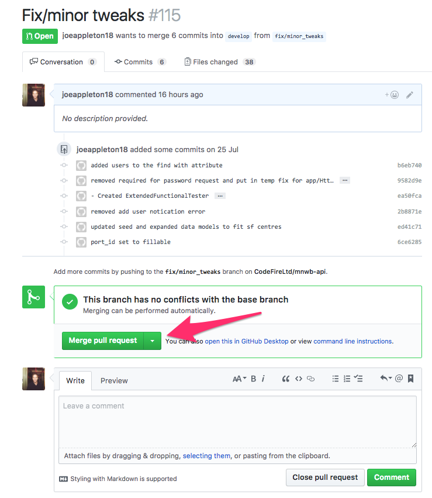

## Git Branching and Team Workflow 

This lesson will introduce you to some more advanced git/GitHub techniques. Also, you'll get to take part in an exercise which harnesses the power of git and gitHub to allow you to collaborate on a programming project.  

**By the end of this session:**

- You will be able to create branches and develop features in isolation
- You will know the basics of how to collaborate on coding projects

## Branching 

>> Branching visualised 

1.  Branching is one of the most powerful features of GIT and can be used to support an individual or a group based workflow.  
1.  Used to develop features in isolation 
1. If I want to develop a cool new feature, I can run `git checkout -b cool_new_feature`
1. The above command simultaneously creates a new branch and checks it out
1. **Note**, I'm now working in complete isolations to the **master** branch

**If you are working on your own project**
 
- When my feature is stable I can switch back to master and merge the changes
	- `git checkout master`
	- `git merge cool_feature`
- Once the branches are merged, it is normal to remove the feature branch 
	- `git branch -d my_cool_feature`

### Using Branching As Part of A Team Workflow 

**Set Up**

- Branches can also be used to support team work 
- In order to collaborate on a project there are a few different strategies. Perhaps the easiest is for the project lead to create a starting GitHub repo and then add all of their team members as collaborators within the settings section of the repository:

>> Figure 1.0 Collaborators should be invited to the project 

Next, all of the team should clone the remote repo to their local workspace. Using `git clone '<repo address>'`.  The address can be found in the top right-hand corner of the remote repository

>> Getting the remote address of a repository 

 
- Each team member can create a branch (step 1-5) above and work in isolation 

- When the branch is ready and changes have been committed, the work can be pushed to GitHub  

`git push origin -u <featurebanchname>`

## Pull Request and Code Reviews

- 
		
>> Raising a pull request

-  When a team member is happy with their work, they can raise a pull request on GitHub.  A pull request is a very powerful mechanism. It checks that there are no conflicts with the master branch and allows team discuss and communication.

- When everyone is happy the feature can be merged into the main project

## Practical 

Please complete the [gitHub teamwork task](task.md) 

##Further Reading and Exercises 
[A very good guide](http://rogerdudler.github.io/git-guide/)   
[GitHub remotes](https://help.github.com/categories/managing-remotes/)  
[Git branching](https://git-scm.com/book/en/v2/Git-Branching-Basic-Branching-and-Merging) 
[Git branching](https://www.atlassian.com/git/tutorials/using-branches/)    
[A great visual tool for learning](http://learngitbranching.js.org/)

